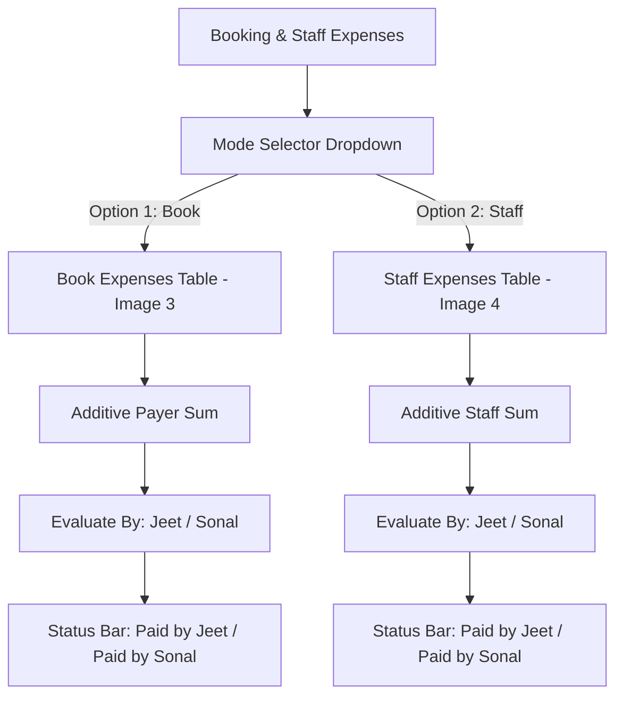

# 📱 MR.X.Change — Bug Fixes & Feature Implementation Report

## 📌 Overview
This document provides a complete technical and functional summary of the fixes and features implemented for the **MR.X.Change** system, specifically addressing Super Admin verification, mathematical integrity in payments, and the new **Book & Staff Expenses evaluation workflow (Images 3 & 4)**.

---

## 🛠️ Section 1: Bug Fixes

### 1. Bug 1: Super Admin Authority & List Verification
- **Issue Diagnosed:**
  - The "Select Super Admin" dropdown previously contained hardcoded dummy names (*Aadarsh Sharma, Rohit Kumar, Neha Patel, Vikram Singh*) who do not possess Super Admin privileges.
- **Root Cause:**
  - Static mockup values hardcoded in the frontend select elements.
- **Solution & Implementation:**
  - Dummy names have been removed completely.
  - The dropdown is now dynamically populated exclusively from verified Super Admins:
    - **All Super Admins**
    - **Jeet Khubchandani** (Super Admin)
    - **Sonal Wadwani** (Super Admin)
    - *(plus dynamic members with `SUPERADMIN` role from `mrx_team_members`).*
  - All page filtering for profits, expenses, and inventory now checks against authentic Super Admin accounts.

---

### 2. Bug 2: Paid Amount $\le$ Total Amount Constraint (Image 2)
- **Issue Diagnosed:**
  - In the "Equate Mobile Payment" modal (Image 2), the system displayed $\text{Total Amount} = ₹54,000$, $\text{Paid Amount} = ₹54,000$, but still showed an abnormal $\text{Pending Amount} = ₹1,000$. Additionally, paid amounts could improperly exceed total amounts.
- **Root Cause:**
  - Unbounded input addition in `handleEquateSubmit` and missing upper-bound clamping on existing paid amounts.
- **Solution & Implementation:**
  - **Strict Mathematical Constraint:**
    $$\text{Paid Amount} \le \text{Total Amount}$$
    $$\text{Pending Amount} = \max(0, \text{Total Amount} - \text{Paid Amount})$$
  - **Auto-Balanced Equate:**
    - If $\text{Total Amount} = ₹54,000$ and $\text{Paid Amount} = ₹54,000$, Pending Amount is strictly **₹0** with a **"Fully Paid (₹0 Pending)"** badge.
    - Added form validation in `New Pay (₹)` input: users cannot enter an amount exceeding the remaining pending balance ($\text{Max Remaining} = \text{Total} - \text{Paid}$).
    - When equating, the "Equated by" dropdown is strictly restricted to **Jeet (Super Admin)** and **Sonal (Super Admin)**.

---

## 🚀 Section 2: Features Implemented (Images 3 & 4)

### 3. Feature 1 & 2: Book and Staff Expenses with "Evaluate By" Status Flow

Under the **"Booking & Staff Expenses"** tab in `Profit, Expense and Statistic`, an interactive dropdown mode selector has been introduced:
- `[ Book v ]`
- `[ Staff v ]`

---

### 📋 Detailed Layouts & Workflows:

#### A. Book Expenses (`[ Book v ]` — Matching Image 3)
| S.No. | Name | Total Spend | Evaluate By | Details |
|---|---|---|---|---|
| ① 1 | **Harsh** *(2 Mobiles)* | **₹ 45,000** | <button>Paid by Jeet</button> / <button>Evaluate</button> | <button>2 Mobiles ▾</button> |

- **Data Redundancy Reduction (Additive Aggregation):**
  - If the same customer/agent (*e.g. Harsh*) books multiple devices (e.g. ₹25,000 + ₹20,000), only **1 consolidated row** is displayed with $\text{Total Spend} = ₹45,000$.
- **Interactive Evaluation:**
  - Clicking **`Evaluate`** opens a popup with Super Admin choices: **`Jeet`** and **`Sonal`**.
  - Clicking **Jeet** changes the button into a verified status bar: **`Paid by Jeet`** (Green badge).
  - Clicking **Sonal** changes the button into a verified status bar: **`Paid by Sonal`** (Purple badge).
- **Expandable Device Breakdown:**
  - Clicking on the row expands to show individual device records: *Booking Date, New Phone Model & Specs, Old Exchanged Phone, Purchased Amount (Paid ₹), Exchange Value, Platform, Payment Method & Ref, Status*.

---

#### B. Staff Expenses (`[ Staff v ]` — Matching Image 4)
| S.No. | Name | Total Spend | Evaluate By | Details |
|---|---|---|---|---|
| ① 1 | **Laksh** *(3 Mobiles)* | **₹ 39,000** | <button>Paid by Sonal</button> / <button>Evaluate</button> | <button>3 Mobiles ▾</button> |

- **Data Redundancy Reduction (Additive Aggregation):**
  - If a staff member (*e.g. Laksh*) pays for multiple devices in Add Inventory, only **1 single row** is rendered showing their total additive spend ($\text{Total Spend} = ₹39,000$).
- **Interactive Evaluation:**
  - Clicking **`Evaluate`** allows assigning either **`Jeet`** or **`Sonal`**.
  - Transforms dynamically into a status bar: **`Paid by Jeet`** or **`Paid by Sonal`**.
- **State Persistence:**
  - Evaluations are persisted in `localStorage` under `mrx_expense_evaluations` and synced across all browser tabs via custom events (`mrx_evaluations_updated`).
- **Expandable Device Breakdown:**
  - Displays all individual intake records: *Date Added, Brand & Model, Specs (RAM/Storage), Color, Paid Amount, Remarks / Accessories, Inventory Status*.

---

## 📂 Modified Files Summary

1. [ProfitExpenseAndStatistic.jsx](file:///c:/Users/NIHARIKA%20SINGH/OneDrive/Desktop/Aadi%20ke%20projects/jeett/mrxchange/staff/frontend/src/pages/ProfitExpenseAndStatistic.jsx)
   - Fixed Super Admin authority list.
   - Built Image 3 (`Book`) and Image 4 (`Staff`) tables.
   - Added person-level additive expense aggregation.
   - Added interactive Super Admin evaluation workflow (`Paid by Jeet` / `Paid by Sonal`).

2. [PendingAndReceivingPayments.jsx](file:///c:/Users/NIHARIKA%20SINGH/OneDrive/Desktop/Aadi%20ke%20projects/jeett/mrxchange/staff/frontend/src/pages/PendingAndReceivingPayments.jsx)
   - Enforced $\text{Paid Amount} \le \text{Total Amount}$ constraint.
   - Fixed calculation breakdown box ($₹54,000$ total and $₹54,000$ paid guarantees strictly $₹0$ pending).
   - Restricted Equated By to verified Super Admins (**Jeet & Sonal**).

---

## 🚢 Git Status
- **Commit:** `Fix Super Admin authorities, enforce Paid Amount <= Total Amount constraint, and implement Book & Staff evaluation by Jeet and Sonal`
- **Branch:** `origin/main`
- **Commit Hash:** `24c7b5e` (Pushed successfully to remote repository).
