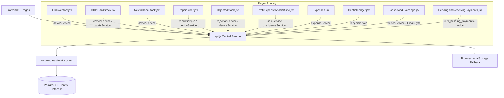

# MR.X.Change — System Architecture & API Mapping Report

> **Target Audience**: Developers, Technical Leads, and System Maintainers  
> **Last Updated**: September 26, 2026  
> **Live Primary Server**: [https://mrchange-qjrl.onrender.com](https://mrchange-qjrl.onrender.com)  
> **Database Engine**: PostgreSQL (Render Central Database) with automatic File-Persistent JSON Fallback Store (`db_store.json`).

---

## 1. Overview & Architectural Stack

The application is structured into a decoupled **Client-Server Architecture**:

- **Frontend**: React 18 SPA initialized with Vite, styled with CSS Design Tokens, and routed via React Router DOM v6.
- **Backend**: Express.js (Node.js) server providing a RESTful JSON API under `/api/*`.
- **Authentication**: JWT (JSON Web Tokens) Bearer token authentication + Offline local credentials fallback for Super Admins (`Jeet Khubchandani` & `Sonal Wadwani`).
- **Data Synchronization**: Multi-layer sync engine merging Central Database REST responses with local storage browser events (`storage`, `mrx_inventory_updated`, `mrx_expenses_updated`, `mrx_sales_updated`, `mrx_pending_payments_updated`).

---

## 2. Global Directory Structure

```
c:\Users\HP\Desktop\Mr.x.change\
├── staff\
│   ├── backend\
│   │   ├── src\
│   │   │   ├── config\          # Database Pool (db.js) & Environment Variables
│   │   │   ├── controllers\     # Express Controller Logic (auth, device, expense, etc.)
│   │   │   ├── middleware\      # JWT Auth Middleware (authMiddleware.js)
│   │   │   ├── models\          # Initial Database Schema & Seeder (seed.js)
│   │   │   ├── routes\          # Express Routers (/api/devices, /api/expenses, etc.)
│   │   │   └── server.js        # Server Entry Point & Express App Initialization
│   │   └── package.json
│   └── frontend\
│       ├── src\
│       │   ├── components\
│       │   │   ├── common\      # UI Modals (PdfExportModal, CameraCaptureModal, UIComponents)
│       │   │   └── layout\      # App Layout Shell (Shell, Sidebar, Topbar)
│       │   ├── context\         # Authentication Context (AuthContext.jsx)
│       │   ├── pages\           # Application Page Views (Dashboard, InHandStock, Expenses, etc.)
│       │   ├── services\        # Frontend API Layer (api.js)
│       │   └── App.jsx          # App Routes & State Wrapper
│       └── package.json
```

---

## 3. Endpoints & Controller Mapping Matrix

| HTTP Method | API Endpoint Path | Controller File | Primary Action / Purpose | Access Role |
| :--- | :--- | :--- | :--- | :--- |
| **POST** | `/api/auth/login` | `authController.js` | User authentication & JWT issuance | Public |
| **GET** | `/api/auth/profile` | `authController.js` | Fetch current logged-in user profile | Authenticated |
| **GET** | `/api/devices` | `deviceController.js` | Query device inventory with filters (`status`, `brand`, `q`) | All Roles |
| **POST** | `/api/devices` | `deviceController.js` | Register new device intake (Old/New inventory) | All Roles |
| **DELETE** | `/api/devices/:id` | `deviceController.js` | Delete device record from inventory | All Roles |
| **PATCH** | `/api/devices/:id/status` | `deviceController.js` | Update device status (`OLD_IN_HAND`, `SOLD`, etc.) | All Roles |
| **POST** | `/api/devices/clean-database` | `deviceController.js` | Purge sample / test inventory stock | SuperAdmin |
| **POST** | `/api/devices/clean-rejected` | `deviceController.js` | Clean/clear all rejected stock items | SuperAdmin |
| **GET** | `/api/expenses` | `expenseController.js` | Query financial expenses with category breakdown | SuperAdmin |
| **POST** | `/api/expenses` | `expenseController.js` | Record operational expense & auto-debit Central Ledger | SuperAdmin |
| **GET** | `/api/sales` | `saleController.js` | Fetch sales history with profit calculations | All Roles |
| **POST** | `/api/sales` | `saleController.js` | Record device sale, update status to `SOLD`, calculate profit | All Roles |
| **GET** | `/api/ledger` | `ledgerController.js` | Get Central Ledger transaction history | SuperAdmin |
| **POST** | `/api/ledger` | `ledgerController.js` | Create manual Central Ledger entry (CREDIT/DEBIT) | SuperAdmin |
| **GET** | `/api/investments` | `investmentController.js` | Fetch capital investment history | SuperAdmin |
| **POST** | `/api/investments` | `investmentController.js` | Inject capital investment into central fund | SuperAdmin |
| **GET** | `/api/dashboard/stats` | `statsController.js` | Live KPI stats & inventory distribution counts | All Roles |
| **GET** | `/api/dashboard/in-hand-stats` | `statsController.js` | Storage/RAM/Value aggregates for in-hand devices | All Roles |
| **GET** | `/api/superadmin/analytics` | `statsController.js` | Gross/Net Profit, ROI, Expense Ratio breakdown | SuperAdmin |
| **GET** | `/api/exports/xls` | `exportController.js` | Generate & download Excel (.xls) report | SuperAdmin |
| **GET** | `/api/exports/pdf` | `exportController.js` | Generate & download PDF report | SuperAdmin |

---

## 4. Frontend Pages to API Service Mapping



### Key Service Wrappers in `staff/frontend/src/services/api.js`:

1. **`deviceService`**:
   - `getDevices(params)`: Queries `/api/devices`. Merges remote database rows with local storage drafts, deduplicating records by `device_code` or physical specs.
   - `createDevice(formData)`: Posts to `/api/devices` and saves locally. Dispatches `mrx_inventory_updated` event.
   - `updateStatus(id, payload)`: Updates status in DB (`PATCH /api/devices/:id/status`) and updates local state.
   - `cleanRejectedStock()`: Invokes `/api/devices/clean-rejected` and purges rejected stock.

2. **`expenseService`**:
   - `getExpenses(params)`: Queries `/api/expenses`. Merges DB response with local fallback.
   - `createExpense(payload)`: Posts to `/api/expenses`. Auto-debits Central Ledger and broadcasts `mrx_expenses_updated`.

3. **`saleService`**:
   - `createSale(payload)`: Posts to `/api/sales`. Updates device status to `SOLD`, logs profit, and broadcasts `mrx_sales_updated`.
   - `getSales()`: Fetches sales list from DB and computes realized profit per sold unit.

4. **`statsService`**:
   - `getDashboardStats()`: Loads KPI distribution counts for Dashboard.
   - `getInHandStats()`: Computes total storage, RAM, and stock valuation for In-hand pages.
   - `getSuperadminAnalytics()`: Fetches total sales, net profit, ROI, and expense ratios.

---

## 5. Security & Role Permission Matrix

Access controls are managed by `AuthContext.jsx` and enforced via `ProtectedRoute` & `SuperAdminRoute` in `App.jsx`:

### Roles:
- **`SUPERADMIN`**: Unrestricted access to all pages and financial reports (`allowedTabs: ['*']`).
- **`STAFF`**: Access restricted to tabs explicitly assigned by a SuperAdmin in `MembersSuperAdmin.jsx`.

### Special SuperAdmin Access:
Users **`Jeet Khubchandani`** (`Jeet` / `Jeet@1`) and **`Sonal Wadwani`** (`Sonal` / `Sonal@1` / `Sunal`) are hardcoded & seeded as **SUPERADMIN** across both offline authentication and central database verification.

| Page Path | Navigation Label | Default Access Control |
| :--- | :--- | :--- |
| `/dashboard` | Dashboard | All Users |
| `/old-inventory` | Add Inventory | Staff & SuperAdmin |
| `/old-in-hand` | Old In-hand Inventory | Staff & SuperAdmin |
| `/new-in-hand` | New In-hand Inventory | SuperAdmin (Jeet & Sonal full access, Staff account-filtered) |
| `/repair-stock` | Repair Inventory | Staff & SuperAdmin |
| `/rejected-stocks` | Rejected Inventory | Staff & SuperAdmin |
| `/booked-exchange` | Exchange | Staff & SuperAdmin |
| `/pending-payments` | Pending and Receiving Payments | SuperAdmin (Jeet & Sonal) |
| `/profit-expense-statistic` | Profit, Expense and Statistic | SuperAdmin (Jeet & Sonal) |
| `/reports` | Report | Staff & SuperAdmin |
| `/members-super-admin` | Members | SuperAdmin Only |
| `/central-ledger` | Central Ledger | SuperAdmin Only |
| `/expenses` | Business Expenses | SuperAdmin Only |
| `/investments` | Capital Investments | SuperAdmin Only |

---

## 6. Real-time Cross-Device Sync Mechanics

To ensure laptop changes appear immediately on mobile phones and vice-versa:

1. **REST API Persistence**: When an action occurs (e.g., adding an expense, marking a device sold, or creating a trade-in), `api.js` makes a synchronous HTTP request to the Render PostgreSQL backend.
2. **Local Event Broadcasting**: Upon API completion, custom DOM events (`mrx_inventory_updated`, `mrx_expenses_updated`, `mrx_sales_updated`, `mrx_pending_payments_updated`, `storage`) are dispatched across all active browser windows and tabs.
3. **Automatic Refetching**: Frontend page components listen to these events via `useEffect` and trigger an immediate data refetch from the API, preventing stale state or data loss on refresh.

---

## 7. Developer Navigation Cheat Sheet

- **To add a new API Endpoint**:
  1. Define controller method in `staff/backend/src/controllers/<controller>.js`.
  2. Add route definition in `staff/backend/src/routes/<route>.js`.
  3. Export corresponding helper function in `staff/frontend/src/services/api.js`.
- **To update page permissions**:
  - Edit `ALL_APPLICATION_TABS` in `staff/frontend/src/pages/MembersSuperAdmin.jsx` and `canAccessTab` in `staff/frontend/src/context/AuthContext.jsx`.
- **To modify database schema**:
  - Update table definitions in `staff/backend/src/models/seed.js` or `staff/backend/src/config/db.js`.
